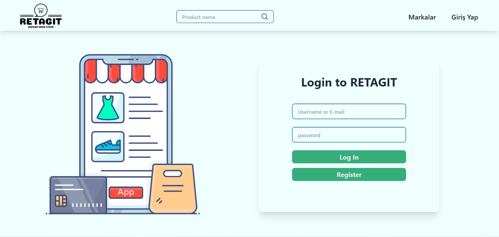
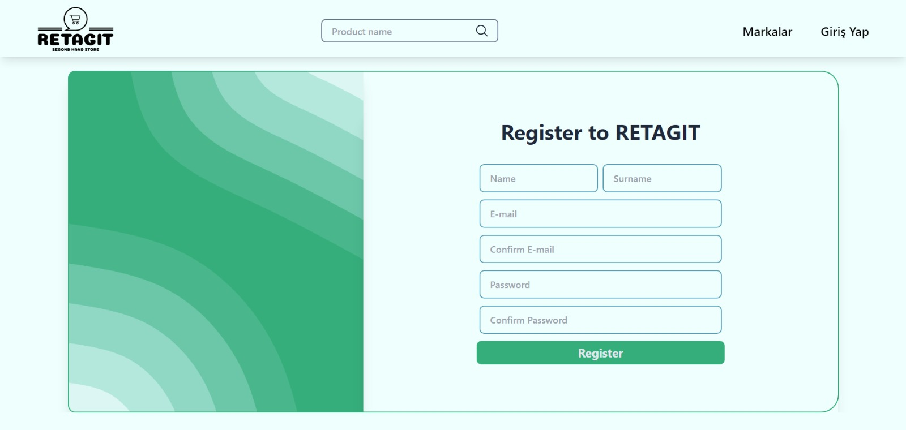
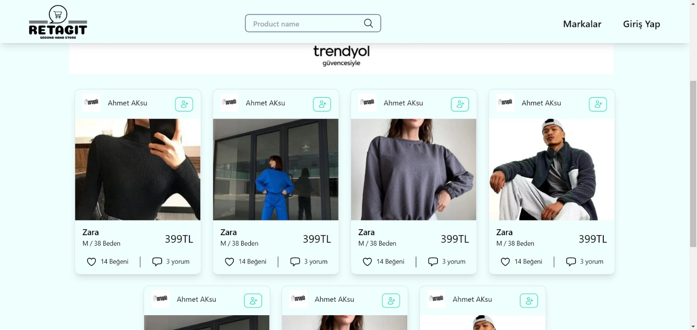
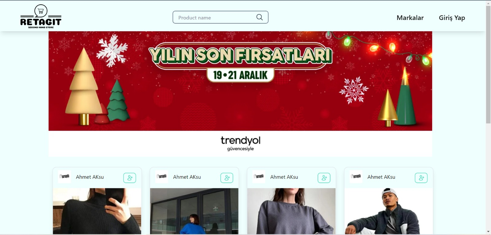

 

# `RETAGIT`

- Retagit is a second hand store every one can re tag and sell their products.

 
 

## `Technologies used in that project:`  
- TypeScript
- Express JS
- Mongodb
- Tailwind CSS
- React JS

 

## `Requirement Analysis Document For Retagit:`  
- Requirement Analysis Documention is created including whole detail for this project. 
You can access Requirement Analysis document from here [RAD]( https://docs.google.com/document/d/1lHns_qcQ7seEmTpVbUHnOGMBoDgG03QzFD-9AS8SFLo/edit?userstoinvite=tripgang34%40gmail.com ).

 

## `Diagrams For Retagit:`  
- For this project activity diagram, class diagram,  sequance diagrams is created.  
You can access all diagrams from provided [Diagrams]( https://docs.google.com/document/d/1pMJLuZOsGAtAr3M_USSRgg9a3fqmWYRFjNc6VdLS8YY/edit ) link here.

 
 

## `login page:` 

 
 

## `Register page:` 

 
 

## `Home page:` 

 
 

## `Home page:` 

 
 

## `Codespaces:`  

 
